<!-- Cover -->
<p align="center">
  
</p>

<p align="center">
  <a href="https://github.com/ariannafrancesconi">
    
  </a>
</p>

<p align="center">
  <a href="mailto:a.francesconi8@gmail.com"></a>
  <a href="https://www.linkedin.com/in/arianna-francesconi"></a>
  <a href="https://scholar.google.com/citations?user=GOOGLE_SCHOLAR_ID"></a>
  <a href="https://orcid.org/0009-0003-6648-575X"></a>
</p>

---

## 👋 About me

```json
{
  "name": "Arianna Francesconi",
  "role": "PhD Candidate in Artificial Intelligence (Health & Life Sciences)",
  "affiliations": [
    "Università Campus Bio-Medico di Roma, Italian National PhD in AI",
    "EPFL · LiGHT Lab, visiting researcher"
  ],
  "research": "Resilient multimodal AI for neurodegenerative disease",
  "keywords": [
    "class imbalance", "confounders & fairness", "domain shift",
    "unpaired modalities", "digital biomarkers", "clinical LLMs"
  ],
  "diseases": ["Alzheimer's", "Parkinson's", "ALS"],
  "dataTypes": "whatever the clinic produces: signals, images, omics, records, text",
  "currently": "Running ADELAI, a prospective AI study in a neurology clinic",
  "service": ["Early-Career Editorial Board, npj Digital Medicine", "PC member, IEEE CBMS"],
  "openTo": "Postdoctoral positions in clinical & translational AI",
  "outsideTheLab": ["Italian Red Cross volunteer 🚑", "gospel choir 🎶", "STEM mentor 🌱"],
  "languages": ["Italian", "English", "Spanish", "French"]
}
```

---

## 🧭 Research map

Real clinical data are imbalanced, confounded, shifted and incomplete, often all at once.
My work lives in the **intersections** of these four problems: each dot below is a project, and the spark follows how one led to the next, all the way to a real neurology clinic.

<p align="center">
  <picture>
    <source media="(prefers-color-scheme: dark)" srcset="assets/research-map-dark.svg"/>
    <source media="(prefers-color-scheme: light)" srcset="assets/research-map-light.svg"/>
    
  </picture>
</p>

| | Study | What it shows | Status |
|:-:|---|---|---|
| 🟢 | **IMBALMED** · class-balancing diversity ensemble | Using the balancing technique itself as the source of ensemble diversity improves Alzheimer's diagnosis and early detection, most where the positive class is rarest. | [CMIG 2025](https://doi.org/10.1016/j.compmedimag.2025.102529) · [code](https://github.com/ariannafrancesconi/Multimodal_AD) |
| 🟢 | **Keystroke dynamics** · cross-dataset transfer | Models pre-trained across typing cohorts keep strong discrimination (AUROC up to 0.91) on a cohort never seen in development. | ECAI 2025 workshop |
| 🔴 | **Confounder audit** · voice + tapping | Under a strict, confounder-matched protocol, single-modality voice gains collapse; the voice + tapping fusion survives. Ships a *Responsible Evaluation Checklist*. | under review |
| 🟠 | **FairPDA** · fair partial-label adaptation | First cross-cohort HC / PD / ALS voice benchmark; external generalisation and gender fairness improve *together*. | under review |
| 🟣 | **HYCA** · hypersphere centre alignment | Learns from modalities that never share a patient, by pulling class prototypes onto a closed-form centre. One scan → a multimodal decision. | under review |
| 🟣 | **Clinical LLMs** · EPFL LiGHT | Language models that combine clinical notes and lab data for ICU outcome prediction and pregnancy-risk decision support. | ongoing |
| 🌈 | **ADELAI** · prospective study | All four challenges at once, in a real neurology clinic: speech, typed text and keystrokes captured during the routine visit. | [enrolling](https://github.com/ariannafrancesconi/ADELAI) |

---

## 🗞️ Recent news

- **2026** · PhD thesis: *Resilient Multimodal AI in Healthcare: Learning under Imbalance, Bias, Domain Shift and Unpaired Modalities*
- **2025–26** · Visiting researcher at **EPFL LiGHT**, working on LLMs for ICU outcome prediction and pregnancy-risk decision support
- **2025** · Joined the Early-Career Editorial Board of **npj Digital Medicine**
- **2025** · IMBALMED published in *Computerized Medical Imaging and Graphics*
- **2025** · Keystroke-dynamics paper presented at an **ECAI 2025** workshop

---

## 💬 Let's talk about

`multimodal learning in the wild` · `evaluation that survives confounders` · `fairness under distribution shift` · `digital biomarkers for neurodegeneration` · `LLMs at the bedside`

> 🔒 Much of my code lives in private clinical and partner repositories. Happy to walk through it in person.

---

<p align="center">
  <picture>
    <source media="(prefers-color-scheme: dark)" srcset="https://raw.githubusercontent.com/ariannafrancesconi/ariannafrancesconi/output/snake-dark.svg"/>
    <source media="(prefers-color-scheme: light)" srcset="https://raw.githubusercontent.com/ariannafrancesconi/ariannafrancesconi/output/snake-light.svg"/>
    
  </picture>
</p>
